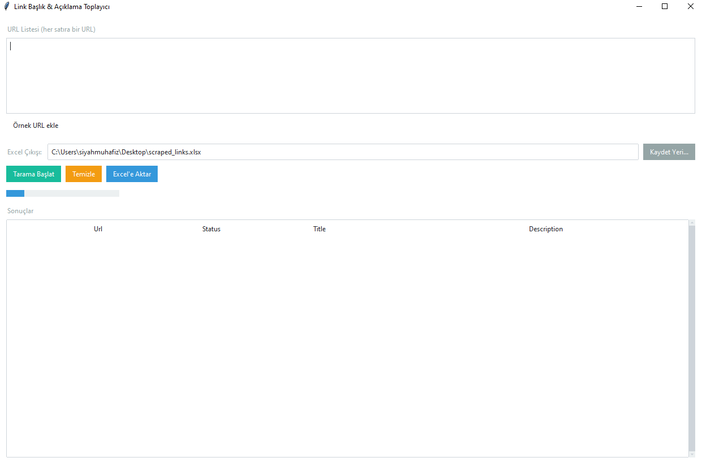

# Link Scraper GUI

🔗 **Link Scraper GUI**, girilen URL listelerinden **başlık (title)** ve **açıklama (description)** verilerini otomatik olarak toplayan, modern arayüzlü (Tkinter + ttkbootstrap) bir Python uygulamasıdır.  
Sonuçlar anlık olarak tabloda görüntülenebilir ve tek tıkla **Excel dosyasına aktarılabilir**.

---

## 🚀 Özellikler
- 🖥️ **Modern GUI**: `ttkbootstrap` teması ile şık ve kullanıcı dostu arayüz.  
- 🌐 **Çoklu URL Desteği**: Aynı anda birden fazla siteyi tarama.  
- ⚡ **Çoklu İş Parçacığı (Threading)**: Hızlı veri çekme için `ThreadPoolExecutor`.  
- 📊 **Excel Çıkışı**: Sonuçları `scraped_links.xlsx` veya seçilen konuma kaydetme.  
- ✅ **Akıllı Başlık & Açıklama Çekimi**: `og:title`, `twitter:title`, <title>, <h1> öncelik sırasıyla başlık bulma.  
- ⏱️ **Timeout & Hata Yönetimi**: Yanıt vermeyen veya hatalı URL’leri otomatik tespit etme.

---

## 📸 Ekran Görüntüsü

---

## 📦 Kurulum

1. Repo’yu klonla:
   git clone https://github.com/ebubekirbastama/link-scraper-gui.git
   cd link-scraper-gui

2. Gerekli paketleri yükle:
   pip install -r requirements.txt

   veya tek tek:
   pip install requests pandas beautifulsoup4 ttkbootstrap openpyxl

---

## ▶️ Kullanım

Programı çalıştır:
   python link_scraper_gui.py

- `URL Listesi` alanına taramak istediğin siteleri gir. (Her satıra bir URL)
- **Tarama Başlat** butonu ile siteleri tara.
- Sonuçlar tabloda listelenir.
- **Excel'e Aktar** butonu ile sonuçları `.xlsx` olarak kaydet.

---

## 📂 Örnek Çıktı

| url                         | status | title                    | description                     |
|-----------------------------|--------|--------------------------|---------------------------------|
| https://example.com         | 200    | Example Domain           | This domain is for use...       |
| https://beykozunsesi.com.tr | 200    | Cemil Tugay U20 Zirvesi  | İzmir Büyükşehir Belediye...    |

---

## ⚙️ Kullanılan Teknolojiler
- Python 3.10+
- Tkinter – GUI
- ttkbootstrap – Modern tema
- Requests – HTTP istekleri
- BeautifulSoup4 – HTML parse
- Pandas – Veri işleme
- OpenPyXL – Excel yazma

---

## 🤝 Katkı
Pull request’ler kabul edilir. Büyük değişiklikler için lütfen önce tartışma açın.  

---

## 📜 Lisans
MIT License  
Bu projeyi özgürce kullanabilir, değiştirebilir ve dağıtabilirsiniz.
